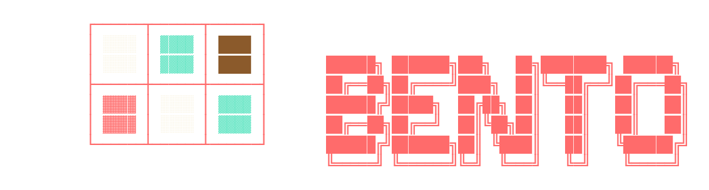

_Your VPS, served on a tray._


[](https://github.com/felipefontoura/bento/stargazers)
[](https://github.com/felipefontoura/bento/commits/main)

[Quickstart](#quickstart) · [Maintainers](CLAUDE.md) · [Issues](https://github.com/felipefontoura/bento/issues)

---

## TL;DR

```bash
bash <(curl -sSL https://raw.githubusercontent.com/felipefontoura/bento/stable/boot.sh)
```

Paste that on a fresh Ubuntu/Debian VPS, answer three questions (domain, admin email, public IP), and ~15 minutes later you have a hardened host, Traefik + Portainer with TLS, the apps you picked, and an HTML handoff report. Already know bento? Copy and go. Want context? Keep reading.

<details>
<summary><strong>Table of contents</strong></summary>

- [What is bento](#what-is-bento)
- [How it works](#how-it-works)
- [Stacks](#stacks)
- [Prerequisites](#prerequisites)
- [After install](#after-install)
- [Operations](#operations)
- [For maintainers and contributors](#for-maintainers-and-contributors)

</details>

---

## What is bento

**A guided installer that turns a fresh VPS into a hardened, TLS-fronted Docker Swarm with the apps you want — in under 15 minutes, with one terminal command.**

You answer three questions (domain, admin email, public IP), walk through three guided steps (harden, infra, apps), and finish with a single HTML report you can hand off to a client. Every secret is generated for you; nothing is hardcoded.

---

## How it works

A one-time bootstrap captures **`BASE_DOMAIN`**, **`ADMIN_EMAIL`**, and your **VPS public IP** (auto-detected). Then three idempotent, re-runnable steps:

### Step 1 — Harden the system

An embedded copy of the [ubinkaze](https://github.com/felipefontoura/ubinkaze) hardening script:
installs Docker, applies kernel sysctl + UFW (with `limit ssh`) + fail2ban + AppArmor + AIDE + auditd + chrony,
creates a `docker` user with your SSH keys, then initializes Docker Swarm and the `network_public` overlay. Requires one reboot.

### Step 2 — Install infrastructure

No prompts. Deploys Traefik (Let's Encrypt + HTTPS redirect) and Portainer at `portainer.<your-domain>`, generates a strong Portainer admin password, displays it once.

### Step 3 — Install applications

Pick from a checklist. For each stack, bento:

1. **Prompts only for env vars without sensible defaults.** Hostnames default to `<key>.<your-domain>`; secrets are auto-generated; DB passwords are reused from the postgres stack.
2. **Deploys via Portainer's API as a Git-backed stack** so Portainer becomes the canonical source of truth for the running spec.
3. **Runs an optional `install.sh`** for post-deploy bootstrap (DB creation, migrations).
4. **Prints the URL** — you open and log in.

---

## Stacks

Each stack is a directory at `stacks/<category>/<key>/` with `compose.yml`, `manifest.json`, and optionally `install.sh`. Adding a new stack is documented in [CLAUDE.md](CLAUDE.md).

| Category | Stack | What it is |
|---|---|---|
| infra | [Traefik](stacks/infra/traefik) | Reverse proxy + Let's Encrypt |
| infra | [Portainer](stacks/infra/portainer) | Stack manager UI |
| db | [PostgreSQL](stacks/db/postgres) | Each app creates its own database in `install.sh` |
| db | [Redis](stacks/db/redis) | In-memory cache |
| app | [Chatwoot](stacks/app/chatwoot) | Customer support platform |
| app | [CLI Proxy API](stacks/app/cli-proxy-api) | OpenAI-compatible proxy in front of CLI providers |
| app | [Evolution API](stacks/app/evolution-api) | WhatsApp gateway |
| app | [n8n](stacks/app/n8n) | Workflow automation |
| app | [n8n MCP](stacks/app/n8n-mcp) | MCP server for n8n |
| app | [Paperclip](stacks/app/paperclip) | AI agent orchestration (Claude Code, Codex, OpenCode) |
| app | [Plunk](stacks/app/plunk) | Open-source email platform |
| app | [RabbitMQ](stacks/app/rabbitmq) | Message broker |
| app | [Typebot](stacks/app/typebot) | Chatbot builder |

---

## Prerequisites

### VPS

<!-- TODO: replace YOUR_REF with the real Hetzner affiliate code before pushing. -->

| Partner | When | Plan | Link |
|---|---|---|---|
| **Hetzner** (primary) | EU/US users — bento is smoke-tested against it every release | CX22, latest Ubuntu LTS | [hetzner.cloud](https://hetzner.cloud/?ref=YOUR_REF) |
| Hostinger (secondary) | Brazil-based users — BRL billing, low BR latency | KVM 2+, latest Ubuntu LTS | [hostinger.com/br/smartdev](https://hostinger.com/br/smartdev) |

<details>
<summary>Affiliate disclosure (read once, applies to both)</summary>

Both links above are affiliate referrals. Signing up through them gives bento a small commission that funds new stacks and bug fixes — there is **no premium price** for you and **no functional difference** from a direct signup. If you'd rather not contribute, just visit [hetzner.com](https://hetzner.com) or [hostinger.com](https://hostinger.com) directly and the installer works identically. Same goes for any apt-based VPS (DigitalOcean, OVH, Vultr, your own metal).

</details>

### DNS

You need a wildcard A record before Step 2, or Let's Encrypt fails on first boot:

| Type | Name             | Value           |
|------|------------------|-----------------|
| A    | `*.mydomain.com` | `<your VPS IP>` |

(bento only uses subdomains. If you already have a website at the bare `mydomain.com`, leave its existing A/CNAME alone — the wildcard above won't touch it.)

[**Open the DNS records page on Cloudflare →**](https://dash.cloudflare.com/?to=/:account/:zone/dns) — Cloudflare prompts you to pick the account + zone, then drops you straight onto the records page. Cloudflare is the recommended DNS host (free tier, fast); any provider works.

Verify before Step 2:

```bash
dig +short A portainer.mydomain.com
# should print your VPS IP
```

### Firewall

| Layer | What it does | Setup |
|---|---|---|
| **Hetzner Cloud Firewall** | Edge filter; optional | Manual, in Hetzner panel |
| **UFW + fail2ban** | Default-deny inbound, `limit ssh`, allow 80/443/ICMP | Automatic during Step 1 |

<details>
<summary>Recommended Hetzner Cloud Firewall ruleset</summary>

In **Firewalls → Create Firewall → Apply to your server**:

| Direction | Source | Port | Protocol | Why |
|---|---|---|---|---|
| Inbound | Your home IP | 22 | TCP | SSH — or leave open and let `ufw limit` + fail2ban handle brute-force |
| Inbound | `0.0.0.0/0` | 80 | TCP | Let's Encrypt HTTP-01 + HTTPS redirect |
| Inbound | `0.0.0.0/0` | 443 | TCP | HTTPS |
| Inbound | `0.0.0.0/0` | any | ICMP | `ping` debugging |
| Outbound | `0.0.0.0/0` | all | all | Default |

If you lock SSH to your home IP and your IP changes (mobile, ISP renewal), use Hetzner's web console to recover. For starter setups, leaving SSH open with `ufw limit` + fail2ban is a reasonable trade-off.

</details>

---

## After install

### Handoff HTML

When Step 3 finishes — or any time, from the **Report** menu — bento writes a self-contained HTML file with the VPS overview, Traefik + Portainer access, and every deployed stack's URL and resolved env vars. Secrets are masked by default with click-to-reveal; print to PDF auto-reveals everything for offline handoff.

```
~/.local/share/bento/reports/handoff-<timestamp>.html       # chmod 600
```

Move it off the VPS:

```bash
scp user@vps:~/.local/share/bento/reports/handoff-*.html .
```

> The report carries live credentials. Treat it like a password vault: deliver over an encrypted channel (1Password, Bitwarden Send, encrypted email), rotate if it ever leaks.

### Ownership: bento vs Portainer

Same split as Helm + kubectl. bento owns the declarative state; Portainer owns day-to-day operations.

| Concern | bento | Portainer |
|---|---|---|
| Declarative state (what should run, with which envs) | owner | viewer |
| First deploy + git-backed updates | owner (via API) | executor |
| Logs, restart, scale, exec | redirect | owner |
| Stacks created outside bento (no `BENTO_MANAGED` label) | ignored | full owner |

Every bento-deployed stack carries `BENTO_MANAGED=true` + its source commit, so bento can spot drift and offer to reconcile during **Update**.

---

## Operations

### Update bento and stacks

Re-running the curl|bash command always re-clones the latest `boot.sh`. Or, from the menu, pick **Update** to:

- Pull the latest bento code locally (`git fetch + reset --hard`).
- Re-deploy any stack whose `compose.yml` or `manifest.json` changed since the last deploy (`POST /api/stacks/<id>/git/redeploy`).

### State and configuration

| Path | Mode | Purpose |
|---|---|---|
| `~/.config/bento/state.json` | 600 | Domain, email, IP, generated secrets, deployed-ref per stack |
| `~/.config/bento/portainer.json` | 600 | Portainer admin credentials |
| `~/.local/state/bento/logs/` | 700 | Hardening + install logs |
| `~/.local/share/bento/reports/` | 700 | Handoff HTML reports |

The state schema is versioned and migrated automatically across bento updates.

### Manual install (no curl|bash)

```bash
git clone --branch stable https://github.com/felipefontoura/bento ~/.local/share/bento
cd ~/.local/share/bento
bash install.sh
```

### Requirements

- Latest Ubuntu LTS, Debian, or any apt-based distro
- `root` or a non-root user with `sudo` — running directly as `root` on a fresh VPS is fine
- 1+ GB RAM, 5+ GB free disk
- Public IPv4
- Wildcard DNS pointing to that IPv4

---

## For maintainers and contributors

Adding a stack, changing conventions, or extending the installer? Read **[CLAUDE.md](CLAUDE.md)** — the canonical maintainer guide. It covers the Bento ↔ Portainer ownership model, the manifest schema, env resolution order, code style for shell + YAML + JSON, and a step-by-step recipe for adding new application stacks (with n8n called out as the gold-standard quality bar).

`.claude/skills/add-app-stack/` is a Claude Code skill that automates the new-stack scaffold for AI-assisted contributions.

PRs welcome. Open an issue first for anything beyond a small fix.

---

## License

Distributed under the MIT License.
